# Architecture Diagrams - Mermaid Code

Copy and paste these diagrams into [Mermaid Live Editor](https://mermaid.live/) or [Eraser.io](https://app.eraser.io/)

---

## 1. High-Level System Architecture (3-Tier)

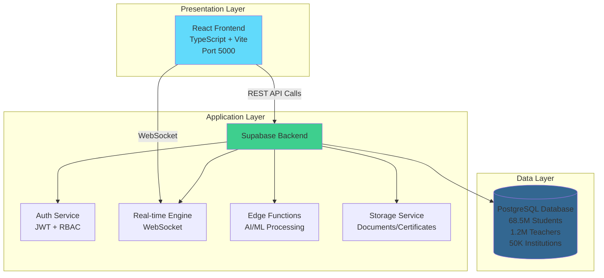

---

## 2. Component Hierarchy

```mermaid
graph TD
    A[App.tsx] --> B[Routes]
    B --> C[Index - Landing Page]
    B --> D[Auth - Login/Signup]
    B --> E[AdminDashboard]
    B --> F[InstitutionDashboard]
    B --> G[StudentDashboard]
    B --> H[TeacherDashboard]
    B --> I[VerifyProfile]
    
    A --> J[Shared Components]
    J --> K[Header]
    J --> L[Footer]
    J --> M[Chatbot]
    J --> N[MapView]
    J --> O[QRCodeGenerator]
    J --> P[ExportTools]
    J --> Q[DigiLocker]
    
    A --> R[Feature Components]
    R --> S[StudentLifeCycleTracker]
    R --> T[Gamification]
    R --> U[JourneyMapper]
    R --> V[AIRecommendations]
    R --> W[PolicyReport]
    R --> X[NIRFAnalytics]
    R --> Y[BlockchainVerification]
    
    style A fill:#ff6b6b
    style B fill:#4ecdc4
    style J fill:#95e1d3
    style R fill:#f38181
```

---

## 3. Data Flow Architecture

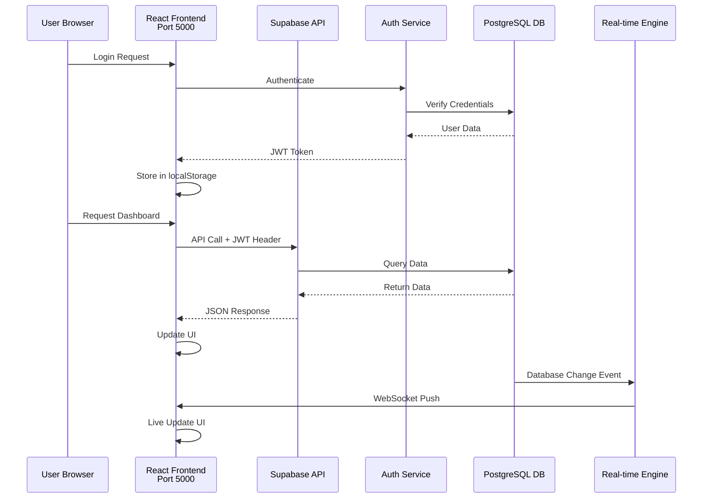

---

## 4. Database ER Diagram

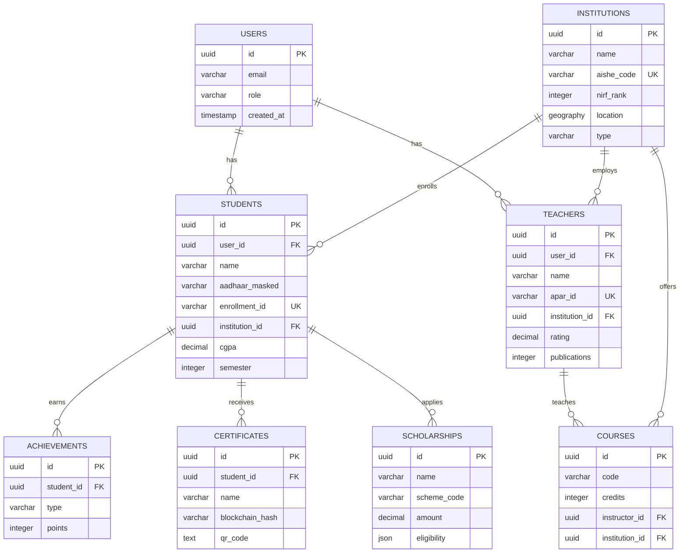

---

## 5. Module Architecture - Student Dashboard

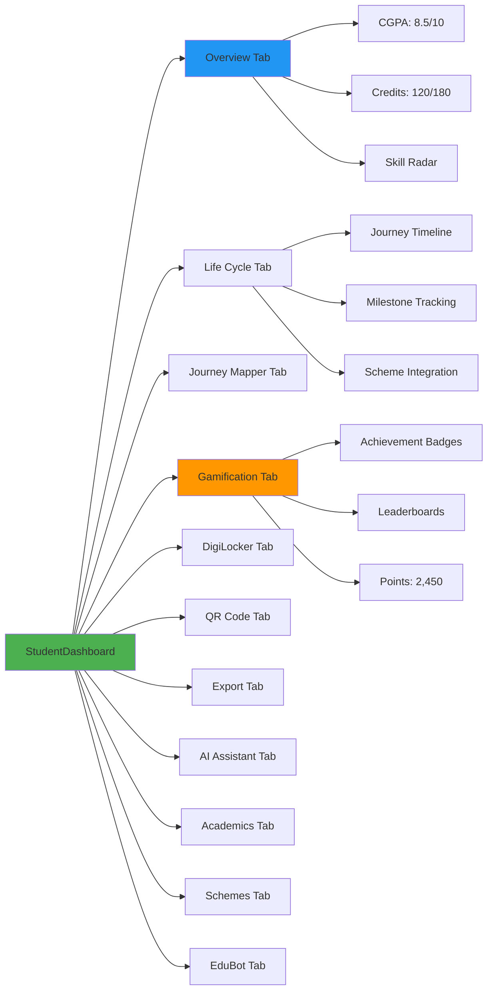

---

## 6. Integration Architecture

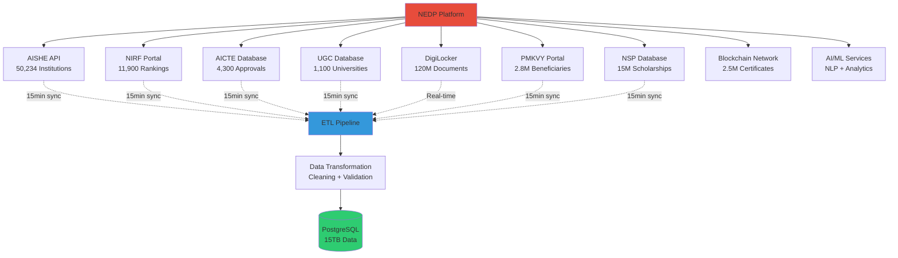

---

## 7. Authentication Flow

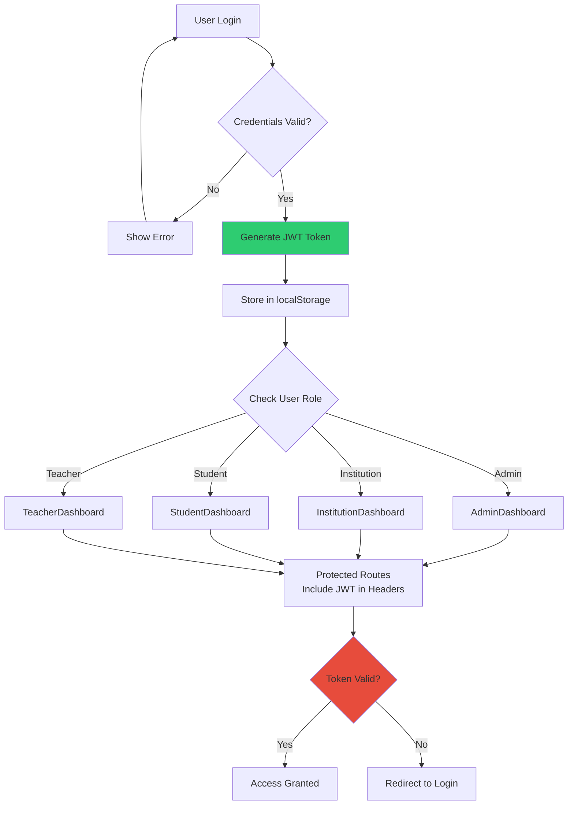

---

## 8. Deployment Architecture

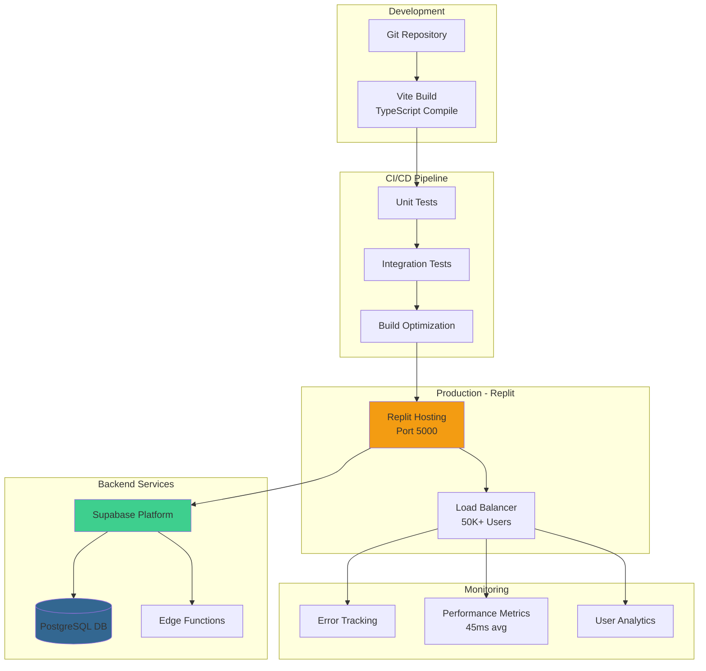

---

## 9. Security Architecture

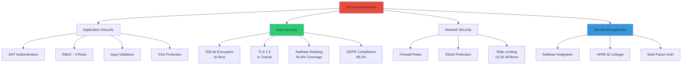

---

## 10. AI/ML Pipeline

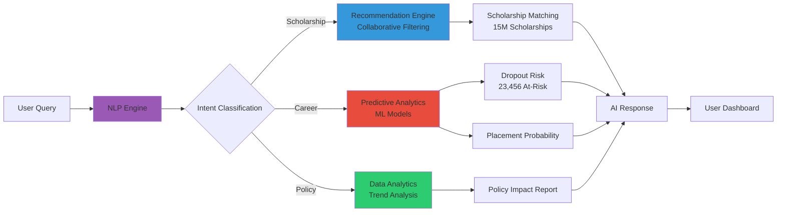

---

## 11. Real-time Data Sync

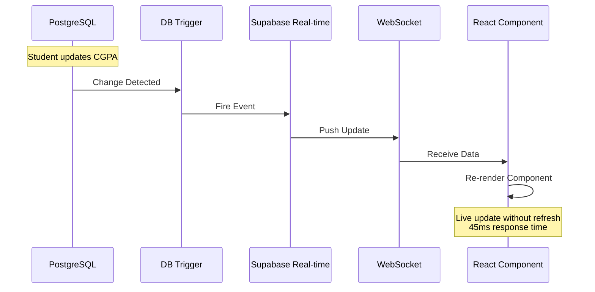

---

## 12. Blockchain Verification Flow

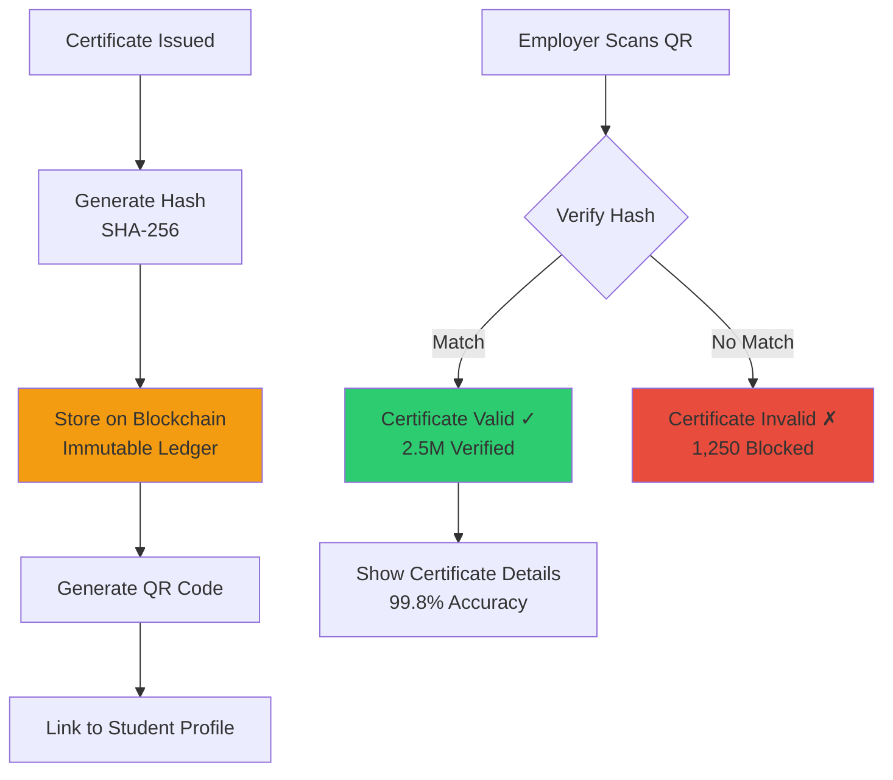

---

## Copy Instructions:

1. **For Mermaid Live Editor**: 
   - Go to https://mermaid.live/
   - Copy any diagram code above
   - Paste in the editor
   - Download as PNG/SVG

2. **For Eraser.io**:
   - Go to https://app.eraser.io/
   - Create new diagram
   - Select "Mermaid" format
   - Paste the code
   - Export as needed

3. **For Documentation**:
   - GitHub/GitLab markdown files support Mermaid natively
   - Just paste the code blocks with ```mermaid syntax
