# NEDP Complete System Architecture - Single Mermaid Diagram

Copy this entire code block into [Mermaid Live Editor](https://mermaid.live/) or [Eraser.io](https://app.eraser.io/)

```mermaid
graph TB
    subgraph "USER LAYER"
        U1[Students<br/>68.5M Users]
        U2[Teachers<br/>1.2M Users]
        U3[Institutions<br/>50K Users]
        U4[Admin<br/>Government]
    end

    subgraph "PRESENTATION LAYER - React Frontend Port 5000"
        UI[React 18 + TypeScript + Vite]
        UI --> R1[Student Dashboard]
        UI --> R2[Teacher Dashboard]
        UI --> R3[Institution Dashboard]
        UI --> R4[Admin Dashboard]
        UI --> R5[Landing Page]
        UI --> R6[Auth System]
        
        R1 --> C1[Life Cycle Tracker]
        R1 --> C2[Journey Mapper]
        R1 --> C3[Gamification]
        R1 --> C4[DigiLocker]
        R1 --> C5[QR Certificates]
        R1 --> C6[AI Assistant]
        R1 --> C7[Scheme Finder]
        
        R4 --> C8[NIRF Analytics]
        R4 --> C9[Policy Report]
        R4 --> C10[Heat Maps]
        R4 --> C11[Gov Initiatives]
    end

    subgraph "APPLICATION LAYER - Supabase Backend"
        API[REST API Gateway]
        AUTH[Auth Service<br/>JWT + RBAC]
        RT[Real-time Engine<br/>WebSocket]
        EDGE[Edge Functions<br/>AI/ML Processing]
        STORAGE[Storage Service<br/>Documents]
        
        API --> AUTH
        API --> RT
        API --> EDGE
        API --> STORAGE
    end

    subgraph "DATA LAYER"
        DB[(PostgreSQL 15TB<br/>Primary Database)]
        CACHE[(Redis Cache<br/>Hot Data)]
        SEARCH[(Search Index<br/>Elasticsearch)]
        
        DB --> T1[users - 70M records]
        DB --> T2[students - 68.5M]
        DB --> T3[teachers - 1.2M]
        DB --> T4[institutions - 50K]
        DB --> T5[courses - 500K]
        DB --> T6[scholarships - 15M]
        DB --> T7[certificates - 2.5M]
        DB --> T8[achievements - 180M]
    end

    subgraph "INTEGRATION LAYER - External Systems"
        EXT1[AISHE API<br/>50,234 Institutions]
        EXT2[NIRF Portal<br/>11,900 Rankings]
        EXT3[AICTE Database<br/>4,300 Approvals]
        EXT4[UGC Database<br/>1,100 Universities]
        EXT5[DigiLocker<br/>120M Documents]
        EXT6[PMKVY Portal<br/>2.8M Beneficiaries]
        EXT7[NSP Database<br/>15M Scholarships]
        EXT8[Blockchain Network<br/>2.5M Certificates]
    end

    subgraph "AI/ML PIPELINE"
        NLP[NLP Engine<br/>Query Understanding]
        REC[Recommendation Engine<br/>Collaborative Filtering]
        PRED[Predictive Analytics<br/>Dropout Risk 23.5K]
        ANALYTICS[Data Analytics<br/>Policy Impact]
        
        NLP --> REC
        NLP --> PRED
        NLP --> ANALYTICS
    end

    subgraph "BLOCKCHAIN LAYER"
        BC1[Smart Contracts<br/>Certificate Issuance]
        BC2[Distributed Ledger<br/>Immutable Records]
        BC3[Verification API<br/>99.8% Accuracy]
        
        BC1 --> BC2
        BC2 --> BC3
    end

    subgraph "ETL PIPELINE - Data Synchronization"
        ETL1[Extract<br/>API Polling 15min]
        ETL2[Transform<br/>Clean + Validate]
        ETL3[Load<br/>PostgreSQL + Cache]
        
        ETL1 --> ETL2
        ETL2 --> ETL3
    end

    subgraph "SECURITY FRAMEWORK"
        SEC1[JWT Authentication<br/>Token-based]
        SEC2[RBAC<br/>4 Role Types]
        SEC3[256-bit Encryption<br/>At Rest]
        SEC4[TLS 1.3<br/>In Transit]
        SEC5[Aadhaar Masking<br/>96.8% Coverage]
        SEC6[GDPR Compliance<br/>98.5%]
    end

    subgraph "MONITORING & ANALYTICS"
        MON1[Error Tracking<br/>Real-time Alerts]
        MON2[Performance Metrics<br/>45ms Response]
        MON3[User Analytics<br/>Behavior Tracking]
        MON4[Load Balancer<br/>50K+ Concurrent]
    end

    subgraph "DEPLOYMENT INFRASTRUCTURE"
        DEPLOY1[Replit Hosting<br/>Primary Server]
        DEPLOY2[CDN Distribution<br/>Global Edge]
        DEPLOY3[CI/CD Pipeline<br/>Automated Deploy]
        DEPLOY4[Auto Scaling<br/>Elastic Load]
    end

    U1 --> UI
    U2 --> UI
    U3 --> UI
    U4 --> UI
    
    UI --> API
    UI --> RT
    
    API --> DB
    API --> CACHE
    API --> SEARCH
    
    EXT1 --> ETL1
    EXT2 --> ETL1
    EXT3 --> ETL1
    EXT4 --> ETL1
    EXT5 --> ETL1
    EXT6 --> ETL1
    EXT7 --> ETL1
    EXT8 --> ETL1
    
    ETL3 --> DB
    
    EDGE --> NLP
    EDGE --> REC
    EDGE --> PRED
    EDGE --> ANALYTICS
    
    DB --> BC1
    BC3 --> C5
    
    AUTH --> SEC1
    AUTH --> SEC2
    DB --> SEC3
    API --> SEC4
    DB --> SEC5
    
    API --> MON1
    API --> MON2
    UI --> MON3
    DEPLOY1 --> MON4
    
    DEPLOY3 --> DEPLOY1
    DEPLOY1 --> DEPLOY2
    DEPLOY1 --> DEPLOY4
    
    RT --> DB
    
    style UI fill:#61dafb,stroke:#333,stroke-width:3px
    style API fill:#3ecf8e,stroke:#333,stroke-width:3px
    style DB fill:#336791,stroke:#333,stroke-width:3px
    style AUTH fill:#ff6b6b,stroke:#333,stroke-width:2px
    style RT fill:#4ecdc4,stroke:#333,stroke-width:2px
    style EDGE fill:#95e1d3,stroke:#333,stroke-width:2px
    style NLP fill:#9b59b6,stroke:#333,stroke-width:2px
    style REC fill:#3498db,stroke:#333,stroke-width:2px
    style PRED fill:#e74c3c,stroke:#333,stroke-width:2px
    style BC2 fill:#f39c12,stroke:#333,stroke-width:2px
    style DEPLOY1 fill:#2ecc71,stroke:#333,stroke-width:3px
    style U1 fill:#ffd93d,stroke:#333,stroke-width:2px
    style U2 fill:#ffd93d,stroke:#333,stroke-width:2px
    style U3 fill:#ffd93d,stroke:#333,stroke-width:2px
    style U4 fill:#ffd93d,stroke:#333,stroke-width:2px
    style R1 fill:#a8e6cf,stroke:#333,stroke-width:1px
    style R2 fill:#a8e6cf,stroke:#333,stroke-width:1px
    style R3 fill:#a8e6cf,stroke:#333,stroke-width:1px
    style R4 fill:#a8e6cf,stroke:#333,stroke-width:1px
    style EXT1 fill:#dfe6e9,stroke:#333,stroke-width:1px
    style EXT2 fill:#dfe6e9,stroke:#333,stroke-width:1px
    style EXT3 fill:#dfe6e9,stroke:#333,stroke-width:1px
    style EXT4 fill:#dfe6e9,stroke:#333,stroke-width:1px
    style EXT5 fill:#dfe6e9,stroke:#333,stroke-width:1px
    style EXT6 fill:#dfe6e9,stroke:#333,stroke-width:1px
    style EXT7 fill:#dfe6e9,stroke:#333,stroke-width:1px
    style EXT8 fill:#dfe6e9,stroke:#333,stroke-width:1px
    style SEC1 fill:#fd79a8,stroke:#333,stroke-width:1px
    style SEC2 fill:#fd79a8,stroke:#333,stroke-width:1px
    style SEC3 fill:#fd79a8,stroke:#333,stroke-width:1px
    style SEC4 fill:#fd79a8,stroke:#333,stroke-width:1px
    style SEC5 fill:#fd79a8,stroke:#333,stroke-width:1px
    style SEC6 fill:#fd79a8,stroke:#333,stroke-width:1px
    style MON1 fill:#74b9ff,stroke:#333,stroke-width:1px
    style MON2 fill:#74b9ff,stroke:#333,stroke-width:1px
    style MON3 fill:#74b9ff,stroke:#333,stroke-width:1px
    style MON4 fill:#74b9ff,stroke:#333,stroke-width:1px
    style ETL1 fill:#a29bfe,stroke:#333,stroke-width:1px
    style ETL2 fill:#a29bfe,stroke:#333,stroke-width:1px
    style ETL3 fill:#a29bfe,stroke:#333,stroke-width:1px
```



## Instructions:

1. **Copy the entire code block above** (from ```mermaid to ```)
2. Go to **[Mermaid Live Editor](https://mermaid.live/)**
3. **Paste** the code in the editor
4. The diagram will render automatically
5. **Download** as PNG, SVG, or PDF using the download button

## Alternative - Eraser.io:

1. Go to **[Eraser.io](https://app.eraser.io/)**
2. Create a new diagram
3. Select **"Mermaid"** format
4. Paste the code
5. Export in your preferred format

## Color Legend:

- 🔵 **Blue** (#61dafb) - Frontend/UI Layer
- 🟢 **Green** (#3ecf8e) - Backend API
- 🔷 **Dark Blue** (#336791) - Database
- 🔴 **Red** (#ff6b6b) - Authentication
- 🟣 **Purple** (#9b59b6) - AI/ML Components
- 🟠 **Orange** (#f39c12) - Blockchain
- 🟡 **Yellow** (#ffd93d) - User Roles
- 🌿 **Mint** (#a8e6cf) - Dashboard Components
- 🩷 **Pink** (#fd79a8) - Security Components
- 💙 **Light Blue** (#74b9ff) - Monitoring
- 💜 **Lavender** (#a29bfe) - ETL Pipeline

This single diagram shows the complete NEDP architecture with all layers, integrations, and data flows in one comprehensive view!
