# NEDP System Workflow - Complete Flow Diagram

Copy this entire code block into [Mermaid Live Editor](https://mermaid.live/) or [Eraser.io](https://app.eraser.io/)

```mermaid
graph TB
    subgraph "USER ENTRY POINTS"
        START1[Student Login<br/>68.5M Users]
        START2[Teacher Login<br/>1.2M Users]
        START3[Institution Login<br/>50K Users]
        START4[Admin Login<br/>Government]
        START5[New User Registration]
    end

    subgraph "AUTHENTICATION WORKFLOW"
        AUTH1{Credentials Valid?}
        AUTH2[Generate JWT Token<br/>256-bit Encryption]
        AUTH3[Store in localStorage]
        AUTH4{Verify Aadhaar/APAR}
        AUTH5[Multi-Factor Auth]
        AUTH6{Role Check}
        AUTH_ERR[Login Failed<br/>Show Error]
    end

    subgraph "STUDENT WORKFLOW"
        S1[Student Dashboard Load]
        S2[Fetch Profile Data<br/>PostgreSQL Query]
        S3[Load Life Cycle Tracker<br/>Academic Journey]
        S4[Display Achievements<br/>Gamification Points]
        S5{User Action?}
        
        S6[View DigiLocker<br/>120M Documents]
        S7[Request Certificate<br/>Generate QR Code]
        S8[Check Scholarships<br/>AI Recommendation]
        S9[Ask AI Assistant<br/>NLP Query]
        S10[Track Journey Map<br/>Career Path]
        
        S11[AI Process Query<br/>Intent Classification]
        S12[Search Scholarships<br/>15M Database]
        S13[Match Eligibility<br/>Collaborative Filter]
        S14[Return Results<br/>JSON Response]
        
        S15[Generate Certificate]
        S16[Create Blockchain Hash<br/>SHA-256]
        S17[Store on Ledger<br/>Immutable Record]
        S18[Generate QR Code]
        S19[Link to Profile]
        S20[Send to DigiLocker]
    end

    subgraph "TEACHER WORKFLOW"
        T1[Teacher Dashboard Load]
        T2[Fetch APAR Data<br/>Performance Metrics]
        T3[View Assigned Courses<br/>Teaching Load]
        T4{Teacher Action?}
        
        T5[Update Grades<br/>Student Marks]
        T6[Validate Input<br/>Range Check]
        T7[Update Database<br/>PostgreSQL Write]
        T8[Trigger Real-time<br/>WebSocket Push]
        T9[Notify Students<br/>Live Update]
        
        T10[Issue Certificate<br/>Course Completion]
        T11[View Analytics<br/>Class Performance]
        T12[Access Resources<br/>Teaching Materials]
    end

    subgraph "INSTITUTION WORKFLOW"
        I1[Institution Dashboard Load]
        I2[Fetch AISHE Data<br/>50,234 Institutions]
        I3[Load NIRF Ranking<br/>Current Position]
        I4{Institution Action?}
        
        I5[Enroll Students<br/>Bulk Upload]
        I6[Parse CSV/Excel<br/>Data Extraction]
        I7[Validate Records<br/>Duplicate Check]
        I8[Insert to Database<br/>Batch Operation]
        I9[Generate Reports<br/>Enrollment Stats]
        
        I10[View NIRF Analytics<br/>Ranking Trends]
        I11[Manage Faculty<br/>APAR Integration]
        I12[Track Placements<br/>Career Outcomes]
    end

    subgraph "ADMIN WORKFLOW"
        A1[Admin Dashboard Load]
        A2[Load System Metrics<br/>50K+ Concurrent Users]
        A3[View Analytics<br/>Heat Maps]
        A4{Admin Action?}
        
        A5[Generate Policy Report<br/>NEP 2020 Impact]
        A6[Analyze Dropout Risk<br/>23,456 At-Risk]
        A7[Predict NIRF Rankings<br/>ML Models]
        A8[Export Data<br/>Excel/PDF]
        
        A9[View Heat Maps<br/>Geographic Distribution]
        A10[Track Gov Initiatives<br/>Scheme Progress]
        A11[Monitor Integrations<br/>8 External APIs]
        A12[System Health Check<br/>Performance Metrics]
    end

    subgraph "DATA PROCESSING PIPELINE"
        ETL1[External API Call<br/>15min Polling]
        ETL2{Data Source?}
        ETL3[AISHE Data<br/>50,234 Records]
        ETL4[NIRF Data<br/>11,900 Rankings]
        ETL5[NSP Data<br/>15M Scholarships]
        ETL6[DigiLocker Data<br/>Real-time Sync]
        
        ETL7[Extract Data<br/>JSON/XML/CSV]
        ETL8[Transform Data<br/>Clean + Validate]
        ETL9[Deduplicate<br/>AI-powered]
        ETL10[Load to PostgreSQL<br/>15TB Database]
        ETL11[Update Cache<br/>Redis Hot Data]
        ETL12[Index Search<br/>Elasticsearch]
    end

    subgraph "AI/ML PROCESSING"
        AI1[Receive User Query]
        AI2[NLP Processing<br/>Intent Detection]
        AI3{Query Type?}
        
        AI4[Scholarship Search<br/>Recommendation Engine]
        AI5[Career Guidance<br/>Predictive Analytics]
        AI6[Policy Analysis<br/>Data Analytics]
        AI7[Dropout Prediction<br/>Risk Assessment]
        
        AI8[Collaborative Filtering<br/>User Behavior]
        AI9[Content-based Filter<br/>Profile Matching]
        AI10[ML Model Inference<br/>TensorFlow]
        AI11[Trend Analysis<br/>Historical Data]
        
        AI12[Format Response<br/>Natural Language]
        AI13[Return to User<br/>JSON/Text]
    end

    subgraph "BLOCKCHAIN WORKFLOW"
        BC1[Certificate Request]
        BC2[Validate Eligibility<br/>Course Completion]
        BC3[Generate Certificate<br/>PDF Template]
        BC4[Create Hash<br/>SHA-256 Algorithm]
        BC5[Smart Contract<br/>Execute Transaction]
        BC6[Write to Ledger<br/>Distributed Storage]
        BC7[Generate QR Code<br/>Verification Link]
        BC8[Store in DigiLocker<br/>Cloud Backup]
        
        BC9[Employer Scans QR]
        BC10[Extract Hash<br/>Parse QR Data]
        BC11{Verify Hash?}
        BC12[Certificate Valid ✓<br/>2.5M Verified]
        BC13[Certificate Invalid ✗<br/>1,250 Blocked]
        BC14[Show Details<br/>99.8% Accuracy]
    end

    subgraph "REAL-TIME SYNC"
        RT1[Database Change<br/>Insert/Update/Delete]
        RT2[Trigger Event<br/>PostgreSQL Trigger]
        RT3[Supabase Real-time<br/>Event Handler]
        RT4[WebSocket Push<br/>Active Connections]
        RT5[Client Receives<br/>React Component]
        RT6[Update UI<br/>Re-render]
        RT7[Show Notification<br/>Toast Message]
    end

    subgraph "EXPORT & REPORTING"
        EXP1[Export Request]
        EXP2{Export Format?}
        EXP3[Excel Format<br/>XLSX Generator]
        EXP4[PDF Format<br/>Document Builder]
        EXP5[CSV Format<br/>Data Serializer]
        EXP6[JSON Format<br/>API Response]
        
        EXP7[Query Database<br/>Filtered Data]
        EXP8[Format Data<br/>Template Apply]
        EXP9[Generate File<br/>Binary/Text]
        EXP10[Download to Client<br/>Browser Download]
    end

    subgraph "ERROR HANDLING & MONITORING"
        ERR1[Error Detected]
        ERR2{Error Type?}
        ERR3[Auth Error<br/>401/403]
        ERR4[Database Error<br/>500]
        ERR5[API Error<br/>Network Timeout]
        ERR6[Validation Error<br/>400]
        
        ERR7[Log to System<br/>Error Tracking]
        ERR8[Alert Admin<br/>Real-time Alert]
        ERR9[Show User Message<br/>Friendly Error]
        ERR10[Retry Logic<br/>Exponential Backoff]
        
        MON1[Monitor Metrics<br/>45ms Response Time]
        MON2[Track Performance<br/>Load Balancer]
        MON3[User Analytics<br/>Behavior Tracking]
    end

    START1 --> AUTH1
    START2 --> AUTH1
    START3 --> AUTH1
    START4 --> AUTH1
    START5 --> AUTH4
    
    AUTH1 -->|Yes| AUTH2
    AUTH1 -->|No| AUTH_ERR
    AUTH2 --> AUTH3
    AUTH3 --> AUTH4
    AUTH4 -->|Valid| AUTH5
    AUTH4 -->|Invalid| AUTH_ERR
    AUTH5 --> AUTH6
    
    AUTH6 -->|Student| S1
    AUTH6 -->|Teacher| T1
    AUTH6 -->|Institution| I1
    AUTH6 -->|Admin| A1
    
    S1 --> S2
    S2 --> S3
    S3 --> S4
    S4 --> S5
    
    S5 -->|DigiLocker| S6
    S5 -->|Certificate| S7
    S5 -->|Scholarship| S8
    S5 -->|AI Chat| S9
    S5 -->|Journey| S10
    
    S8 --> S11
    S11 --> S12
    S12 --> S13
    S13 --> S14
    S14 --> S5
    
    S7 --> S15
    S15 --> S16
    S16 --> S17
    S17 --> S18
    S18 --> S19
    S19 --> S20
    S20 --> S5
    
    T1 --> T2
    T2 --> T3
    T3 --> T4
    
    T4 -->|Grades| T5
    T4 -->|Certificate| T10
    T4 -->|Analytics| T11
    T4 -->|Resources| T12
    
    T5 --> T6
    T6 --> T7
    T7 --> T8
    T8 --> T9
    T9 --> T4
    
    I1 --> I2
    I2 --> I3
    I3 --> I4
    
    I4 -->|Enrollment| I5
    I4 -->|NIRF| I10
    I4 -->|Faculty| I11
    I4 -->|Placements| I12
    
    I5 --> I6
    I6 --> I7
    I7 --> I8
    I8 --> I9
    I9 --> I4
    
    A1 --> A2
    A2 --> A3
    A3 --> A4
    
    A4 -->|Policy| A5
    A4 -->|Dropout| A6
    A4 -->|NIRF| A7
    A4 -->|Export| A8
    A4 -->|Heat Map| A9
    A4 -->|Initiatives| A10
    A4 -->|Health| A12
    
    A5 --> EXP1
    A8 --> EXP1
    
    ETL1 --> ETL2
    ETL2 -->|AISHE| ETL3
    ETL2 -->|NIRF| ETL4
    ETL2 -->|NSP| ETL5
    ETL2 -->|DigiLocker| ETL6
    
    ETL3 --> ETL7
    ETL4 --> ETL7
    ETL5 --> ETL7
    ETL6 --> ETL7
    
    ETL7 --> ETL8
    ETL8 --> ETL9
    ETL9 --> ETL10
    ETL10 --> ETL11
    ETL11 --> ETL12
    ETL12 --> RT1
    
    S9 --> AI1
    AI1 --> AI2
    AI2 --> AI3
    
    AI3 -->|Scholarship| AI4
    AI3 -->|Career| AI5
    AI3 -->|Policy| AI6
    AI3 -->|Dropout| AI7
    
    AI4 --> AI8
    AI5 --> AI10
    AI6 --> AI11
    AI7 --> AI10
    
    AI8 --> AI12
    AI9 --> AI12
    AI10 --> AI12
    AI11 --> AI12
    AI12 --> AI13
    AI13 --> S5
    
    S7 --> BC1
    T10 --> BC1
    BC1 --> BC2
    BC2 --> BC3
    BC3 --> BC4
    BC4 --> BC5
    BC5 --> BC6
    BC6 --> BC7
    BC7 --> BC8
    
    BC9 --> BC10
    BC10 --> BC11
    BC11 -->|Valid| BC12
    BC11 -->|Invalid| BC13
    BC12 --> BC14
    
    RT1 --> RT2
    RT2 --> RT3
    RT3 --> RT4
    RT4 --> RT5
    RT5 --> RT6
    RT6 --> RT7
    
    EXP1 --> EXP2
    EXP2 -->|Excel| EXP3
    EXP2 -->|PDF| EXP4
    EXP2 -->|CSV| EXP5
    EXP2 -->|JSON| EXP6
    
    EXP3 --> EXP7
    EXP4 --> EXP7
    EXP5 --> EXP7
    EXP6 --> EXP7
    
    EXP7 --> EXP8
    EXP8 --> EXP9
    EXP9 --> EXP10
    
    ERR1 --> ERR2
    ERR2 -->|Auth| ERR3
    ERR2 -->|Database| ERR4
    ERR2 -->|API| ERR5
    ERR2 -->|Validation| ERR6
    
    ERR3 --> ERR7
    ERR4 --> ERR7
    ERR5 --> ERR7
    ERR6 --> ERR7
    
    ERR7 --> ERR8
    ERR8 --> ERR9
    ERR9 --> ERR10
    
    ERR10 --> MON1
    MON1 --> MON2
    MON2 --> MON3
    
    style START1 fill:#ffd93d,stroke:#333,stroke-width:2px
    style START2 fill:#ffd93d,stroke:#333,stroke-width:2px
    style START3 fill:#ffd93d,stroke:#333,stroke-width:2px
    style START4 fill:#ffd93d,stroke:#333,stroke-width:2px
    style START5 fill:#ffd93d,stroke:#333,stroke-width:2px
    
    style AUTH2 fill:#2ecc71,stroke:#333,stroke-width:2px
    style AUTH_ERR fill:#e74c3c,stroke:#333,stroke-width:2px
    
    style S1 fill:#61dafb,stroke:#333,stroke-width:2px
    style T1 fill:#61dafb,stroke:#333,stroke-width:2px
    style I1 fill:#61dafb,stroke:#333,stroke-width:2px
    style A1 fill:#61dafb,stroke:#333,stroke-width:2px
    
    style AI2 fill:#9b59b6,stroke:#333,stroke-width:2px
    style AI4 fill:#3498db,stroke:#333,stroke-width:2px
    style AI5 fill:#3498db,stroke:#333,stroke-width:2px
    style AI6 fill:#3498db,stroke:#333,stroke-width:2px
    style AI7 fill:#e74c3c,stroke:#333,stroke-width:2px
    
    style BC5 fill:#f39c12,stroke:#333,stroke-width:2px
    style BC6 fill:#f39c12,stroke:#333,stroke-width:2px
    style BC12 fill:#2ecc71,stroke:#333,stroke-width:2px
    style BC13 fill:#e74c3c,stroke:#333,stroke-width:2px
    
    style ETL10 fill:#336791,stroke:#333,stroke-width:2px
    style ETL11 fill:#e74c3c,stroke:#333,stroke-width:2px
    style ETL12 fill:#f39c12,stroke:#333,stroke-width:2px
    
    style RT3 fill:#4ecdc4,stroke:#333,stroke-width:2px
    style RT4 fill:#4ecdc4,stroke:#333,stroke-width:2px
    
    style EXP3 fill:#95e1d3,stroke:#333,stroke-width:2px
    style EXP4 fill:#95e1d3,stroke:#333,stroke-width:2px
    style EXP5 fill:#95e1d3,stroke:#333,stroke-width:2px
    
    style ERR7 fill:#fd79a8,stroke:#333,stroke-width:2px
    style ERR8 fill:#fd79a8,stroke:#333,stroke-width:2px
    style MON1 fill:#74b9ff,stroke:#333,stroke-width:2px
```



## Instructions:

1. **Copy the entire code block above** (from ```mermaid to ```)
2. Go to **[Mermaid Live Editor](https://mermaid.live/)**
3. **Paste** the code in the editor
4. The workflow diagram will render automatically
5. **Download** as PNG, SVG, or PDF

## Alternative - Eraser.io:

1. Go to **[Eraser.io](https://app.eraser.io/)**
2. Create a new diagram
3. Select **"Mermaid"** format
4. Paste the code
5. Export in your preferred format

## Workflow Coverage:

This comprehensive diagram shows:

✅ **User Entry** - All 4 user types + registration  
✅ **Authentication** - Complete JWT + Aadhaar flow  
✅ **Student Workflow** - Life cycle, certificates, scholarships, AI chat  
✅ **Teacher Workflow** - Grade updates, APAR, real-time sync  
✅ **Institution Workflow** - Enrollment, NIRF, faculty management  
✅ **Admin Workflow** - Policy reports, analytics, heat maps  
✅ **ETL Pipeline** - External API integration (8 sources)  
✅ **AI/ML Processing** - NLP, recommendations, predictions  
✅ **Blockchain** - Certificate issuance & verification  
✅ **Real-time Sync** - WebSocket push notifications  
✅ **Export Tools** - Excel, PDF, CSV, JSON  
✅ **Error Handling** - Complete error & monitoring flow

## Color Legend:

- 🟡 **Yellow** (#ffd93d) - User Entry Points
- 🟢 **Green** (#2ecc71) - Success States
- 🔴 **Red** (#e74c3c) - Error States / Critical
- 🔵 **Blue** (#61dafb) - Dashboard Pages
- 🟣 **Purple** (#9b59b6) - AI/ML Processing
- 🟠 **Orange** (#f39c12) - Blockchain Operations
- 🔷 **Dark Blue** (#336791) - Database Operations
- 🌊 **Teal** (#4ecdc4) - Real-time Features
- 🌿 **Mint** (#95e1d3) - Export Functions
- 🩷 **Pink** (#fd79a8) - Error Handling
- 💙 **Light Blue** (#74b9ff) - Monitoring

This single diagram shows the complete end-to-end workflow of the NEDP platform with all user journeys, data flows, and system interactions!
